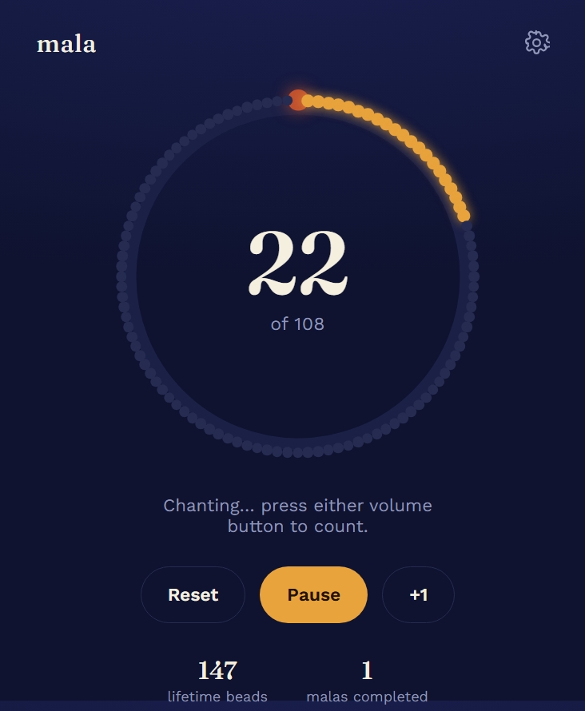

# Mala — Japa Counter

A static, one-page site for counting japa (mantra chanting). Set a target,
chant while pressing your phone's **volume button** to count, and a flute
alarm plays when you hit your target.

## What's inside
- `index.html` — the app
- `styles.css` — the look (indigo night sky, marigold accent, a bead ring you fill in as you chant)
- `app.js` — all the logic
- `assets/alarm.mp3` — the flute clip you uploaded, used as the completion sound

No build step, no dependencies, no server. It's plain HTML/CSS/JS.

## Important: how the volume-button counting actually works

There is **no official way** for a website to detect hardware volume-button
presses — browsers don't expose that. This app uses a known workaround:

- It plays a silent, looping audio clip in the background.
- Pressing a volume button changes the phone's system volume, which fires a
  `volumechange` event on that audio element.
- The app listens for that event and counts it as one chant.

# Mala - Japa Counter



A calm, mobile-first japa counter for mantra practice. Set a target, count
each repetition with a tap or a phone volume button, and receive a flute alarm
when the round is complete.

This is a dependency-free static web app built with HTML, CSS, and vanilla
JavaScript. It can be hosted directly from GitHub Pages and keeps your stats
on your device rather than sending them to a server.

## Features

- Bead ring that fills as the count increases, including a larger guru bead
- Preset targets of 108, 54, 27, and 11, plus any custom target
- Tap mode that works across modern browsers and devices
- Best-effort volume-button mode for Android Chrome and compatible Chromium browsers
- Vibration feedback for each count when supported by the device
- Optional flute alarm when a target is reached
- Stop and reset, or stop and continue with another round
- Lifetime bead and completed mala statistics stored with `localStorage`
- Optional screen wake lock while a session is active
- Responsive layout for phones and desktop testing
- No build step, package manager, backend, or account required

## Screenshot

The interface shown above is stored in [`image/app_ui.jpeg`](image/app_ui.jpeg).

## Quick start

Open [`index.html`](index.html) in a browser. For the most reliable local
preview, serve the folder with any static web server, for example:

```bash
python -m http.server 8000
```

Then visit `http://localhost:8000`.

## How to use

1. Open the app and choose a target in Settings.
2. Choose `Tap the screen` for the universal option, or `Volume button` on a
   compatible Android browser.
3. Tap **Start**.
4. Count each repetition with `+1`, the ring, or a volume button.
5. When the target is reached, stop the alarm and reset or begin another round.

## Volume-button mode limitations

Web browsers do not provide an official hardware volume-button API. Volume
mode uses a silent looping audio element and listens for its `volumechange`
event. Because of that browser workaround:

- It is most reliable on Android Chrome and similar Chromium browsers.
- It is not supported by iPhone/Safari; use tap mode on iOS.
- The phone's media volume may move slightly while counting.
- The tab must remain open and in the foreground.
- Enable **Keep screen on while chanting** when the browser supports the Wake
  Lock API.

Tap mode is the recommended fallback whenever volume detection is unavailable.

## Project structure

```text
.
├── index.html          # App markup and accessible controls
├── styles.css          # Responsive visual design
├── app.js              # Counter, settings, persistence, and device features
├── assets/
│   └── alarm.mp3        # Completion flute audio
└── image/
    └── app_ui.jpeg      # README screenshot
```

## Deploy with GitHub Pages

1. Create a GitHub repository and push the contents of this folder to its
   `main` branch.
2. Open the repository's **Settings > Pages** page.
3. Select **Deploy from a branch**, choose `main` and `/ (root)`, then save.
4. Open the generated Pages URL on your phone.

The repository includes `.nojekyll` so GitHub Pages serves this static site
without Jekyll processing.

### Git commands

```bash
git init
git add .
git commit -m "Add Mala japa counter"
git branch -M main
git remote add origin https://github.com/YOUR_USERNAME/YOUR_REPOSITORY.git
git push -u origin main
```

## Privacy

The app has no backend and makes no application data requests. Your current
target, progress, preferences, lifetime count, and completed sessions are
stored locally in the browser with `localStorage`. Clearing browser storage
will remove that data.

## License

Copyright 2026 Srusti. This project is available for personal, non-commercial
use only under the terms in [`LICENSE`](LICENSE). Commercial use,
redistribution, sublicensing, publication, and creation of derivative works
require prior written permission from Srusti.
